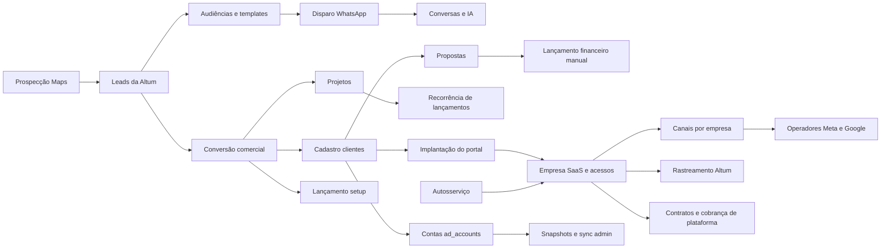

# Auditoria e proposta da área administrativa Altum

Data: 17/09/2026. Escopo autorizado: diagnóstico e definição do admin, sem implementar o redesign ou executar operações externas.

## Conclusão executiva

O admin já tem uma base relevante de agência, comercial, entrega e governança SaaS. O problema principal é a coexistência de modelos antigos e novos, contratos de interface/API divergentes e ausência de uma operação consistente por carteira. Criar mais telas antes de recuperar esses fluxos amplia a fragmentação.

Direção proposta: uma central de operação comercial com IA para a Altum gerenciar várias empresas. Reaproveitar os serviços dos workspaces de clientes, com autorização administrativa explícita, em vez de duplicar motores de anúncios, atendimento, cobrança e IA.

Primeiro corrigir fluxos e tornar falhas visíveis. Depois consolidar carteira, implantação, integrações e resultados. Só então introduzir execução em lote, MCP administrativo e otimização de estratégias.

## Método e limites da evidência

- Inventário por AST TypeScript, ignorando comentários: páginas, imports locais, chamadas HTTP diretas/transitivas, handlers, guards e coleções literais.
- Leitura manual dos caminhos de empresas, contratos, permissões, prospecção, conversão, projetos, atividades, cobrança, templates, anúncios, IA e MCP.
- Testes existentes de MCP, conectores, growth, operação, observabilidade e segurança; checagem de configuração local sem exibir valores secretos.
- Sem chamadas a provedores com credenciais reais; sem envio de mensagens, cobrança, criação ou alteração de campanhas, deploy ou migração de dados.
- Navegador integrado indisponível na tentativa desta conversa. Layout avaliado por código, não por screenshots. Responsividade, contraste efetivo, uploads e jornadas autenticadas não foram comprovados.
- Nenhuma consulta ao banco publicado. Registros órfãos, duplicação já ocorrida e estado real de contas permanecem hipóteses a verificar.
- A árvore de trabalho já contém alterações de outras tarefas. Este relatório descreve o estado local observado, não necessariamente a versão publicada.
- Existência de endpoint e aprovação em teste local não comprovam operação em produção. Vários testes validam funções puras, contratos de fonte ou provedores simulados.

Inventário: 24 páginas encontradas, sendo 23 anteriores ao rascunho de mídia; 37 handlers sob `/api/admin`, sendo 36 anteriores ao rascunho. Foram identificadas 119 chamadas diretas de fetch/wrappers, das quais 111 têm rota e método correspondentes no exame estático. As demais foram revisadas abaixo; não são oito rotas quebradas.

Arquivos reproduzíveis:

- `scripts/audit-admin-connections.mjs`: executar com `node scripts/audit-admin-connections.mjs`.
- `docs/admin-audit-inventory.json`: inventário de páginas e dependências.
- `docs/admin-audit-api-inventory.json`: handlers administrativos e guards encontrados.
- `docs/admin-audit-summary.json`: contagens e referências que exigem revisão.

O script não resolve todas as variáveis, helpers de autorização, URLs calculadas ou coleções dinâmicas; não verifica schemas de request/response nem autorização em runtime. Os números são de referências, não de funcionalidades únicas.

## Legenda

- **Quebra confirmada no código**: interface e implementação são incompatíveis em um caminho identificável.
- **Parcialmente integrado**: há implementação real, mas o fluxo cobre somente parte da operação.
- **Risco confirmado no desenho**: o mecanismo de proteção/vínculo não aparece no caminho lido; ocorrência real ainda não comprovada.
- **Implementado; runtime pendente**: existe caminho funcional no código, mas falta teste autenticado e externo.
- **Proposto**: não tratar como funcionalidade disponível.

## Inventário das telas

| Tela/rota | Implementação observada | Situação e avaliação |
|---|---|---|
| `/admin/dashboard` | Leads, projetos, propostas, atividades e financeiro; sinais da IA | Parcialmente integrado. Retrato de agência, com limites de leitura; não é ainda comando completo por carteira SaaS. |
| `/admin/saas` | Contratos, tenants, receita, acessos, pendências e edição de planos | Implementado; runtime pendente. Usa contratos como eixo da visão; tenants sem contrato podem ficar fora da carteira contratual. |
| `/admin/clientes` | Cadastro, lista, busca, exclusão e entrada no portal | Parcialmente integrado. Lista `clientes`, sem unificar tenants de autosserviço. Exclusão física não trata referências. |
| `/admin/clientes/[id]` | Resumo de empresa, projetos, propostas, financeiro, atividades e tenant | Implementado; runtime pendente. O resumo aceita tenant direto, mais abrangente que a listagem. Campos e vínculos antigos exigem reconciliação. |
| `/admin/clientes/[id]/portal` | Contrato, acesso, convite, implantação, perfil de negócio e conexão com prontidão | Parcialmente integrado. Boa base de governança, mas contratos exigem owner onde outras ações aceitam administrador. Tela extensa e mistura comercial com configuração técnica. |
| `/admin/prospeccao` | Lista/funil, inteligência, distribuição, audiência e disparo WhatsApp | Implementado; runtime pendente. Fluxo real aproveitável, com templates/audiências centrados em `ALTUM_AGENCY`; falta acompanhamento consolidado de resultado dos disparos. |
| `/admin/prospeccao/gerar` | Busca Maps, filtros, seleção, criação e enriquecimento de leads | Implementado; runtime pendente. Preservar; verificar dados retornados, quotas, duplicação e continuidade até venda. |
| `/admin/prospeccao/[id]` | Perfil, CRM, notas, oferta, inteligência, eventos, cobrança e conversão | Parcialmente integrado. Conversão tem risco de repetição e herda tenant do lead; não provisiona automaticamente uma empresa SaaS nova. |
| `/admin/pipeline` | Kanban comercial e mudança de `pipelineStage` | Integrado à jornada comercial. `stage` descreve maturidade digital na prospecção e é um conceito diferente; preservar ambos. |
| `/admin/chat` | Chats, mensagens, contexto, ações, transferência, mídia e envio | Implementado; runtime pendente. Admin consulta chats globais sem filtro de carteira/tenant na API de lista; não equivale a um inbox exclusivamente interno. |
| `/admin/templates` | Leitura de biblioteca WABA, filtros e pacote de template | Quebra confirmada no botão de sincronização por POST. Leitura GET implementada. |
| `/admin/campanhas` | Cadastro de contas, snapshots manuais, sync, logs e insights | Parcialmente integrado. Credenciais/vínculos diferem do operador tenant; TikTok/LinkedIn sem conector de sync; insights são heurísticos. |
| `/admin/projetos` | Lista e criação por empresa | Implementado; runtime pendente. Depende de `clientes`; falhas podem aparecer como lista vazia. |
| `/admin/projetos/[id]` | Edição, serviços, status e geração de recorrência financeira | Parcialmente integrado. Recorrência cria lançamentos; não equivale a uma assinatura externa. Risco de repetir cobranças internas. |
| `/admin/atividades` | Criação, conclusão, exclusão, prazo e referência de lead | Parcialmente integrado. Usa nome de cliente, sem ID de empresa no contrato de criação; falhas de consulta ficam no console. |
| `/admin/orcamentos` | Cadastro e lista com vínculo de cliente/projeto | Implementado; runtime pendente. Usa cadastro antigo de empresas; verificar cobertura por perfil. |
| `/admin/orcamentos/[id]` | Edição, status e geração de lançamento financeiro | Parcialmente integrado. Aprovação altera status; lançamento é uma ação separada, sem chave de proposta no contrato financeiro lido. |
| `/admin/financeiro` | Receitas, despesas, pagamento, comissões e resumo SaaS | Parcialmente integrado. Ações financeiras exigem owner; lançamento local não prova emissão externa ou reconciliação. |
| `/admin/financeiro/[id]` | Consulta e edição de lançamento | Implementado; runtime pendente. Mesma revisão de permissões e distinção entre status local/provedor. |
| `/admin/ia` | Sinais, consumo, jobs, aprendizado, notificações e perguntas | Parcialmente integrado. Existem motores de observabilidade e aprendizado; uma falha de qualquer uma das cinco fontes bloqueia a atualização de todas. |
| `/admin/playbook` | Consulta/edição e dicas comerciais persistidas | Implementado; runtime pendente. Verificar consumo pelos agentes e inteligência; não confundir biblioteca editável com estratégia de mídia aprendida. |
| `/admin/equipe` | Lista, convite, alteração, bloqueio/desbloqueio e reenvio | Quebra de coerência por perfil: admin vê menu, mutações exigem owner. Carteiras e permissões operacionais ainda precisam ser definidas. |
| `/admin/config` | Configuração geral e presença de variáveis de integração | Parcialmente integrado. Status global de configuração não é health check de credencial por empresa. |
| `/admin/midia` | Rascunho local de contas, relatórios salvos e tracking | Fora do produto aprovado. Criado antes do alinhamento, não publicado ou validado visualmente; não contar como fase concluída. |

### Avaliação visual por código

Shell, navegação, equipe, templates, SaaS e listagem de empresas já usam superfícies claras. Campanhas, configuração, pipeline e partes de telas de detalhe ainda usam bases escuras e texto com opacidades de branco. Isso cria inconsistência de hierarquia; o contraste efetivo depende também do CSS e precisa de verificação visual.

Há mistura de CRM da própria Altum, gestão de clientes SaaS, configurações técnicas e operação de campanhas no mesmo nível. Algumas telas extensas concentram tarefas diferentes. Reorganizar por trabalho e perfil antes de trocar cores: decidir, executar, entregar, cobrar e configurar.

## Achados priorizados e evidência

### A01 — Sincronização de templates sem handler POST — prioridade 0

**Quebra confirmada no código.** `app/admin/templates/page.tsx:218` faz POST em `/api/admin/whatsapp/templates`; `app/api/admin/whatsapp/templates/route.ts:26` exporta somente GET. A operação não tem handler e, no comportamento normal da rota, retorna método não permitido. O plano anterior descreve sincronização como aplicada, mas não representa este estado do código.

Decisão: recuperar a operação explicitamente ou retirar a ação até ela estar implementada. Critério: leitura GET e sincronização POST testadas separadamente, com falha do provedor visível. Não executar criação de templates durante a auditoria.

### A02 — Interface de administrador com APIs de proprietário — prioridade 0

**Quebra confirmada no código para `agency_admin`.** `context/AuthContext.tsx:228` inclui `agency_admin` em `isAdmin`. Em `app/lib/server/route-auth.ts`, o papel legado `admin` é normalizado para `agency_owner`; exigir `roles: ["admin"]` não aceita `agency_admin`.

Isso afeta contratos (`get`, `upsert`, `control`, `stripe`), mutações de equipe, criação/edição/exclusão financeira e recorrência de projeto. Evidências: `app/api/admin/client-portal/contracts/control/route.ts:40`, `app/api/admin/users/update/route.ts:30`, `app/api/finance/transactions/create/route.ts:35`, `app/api/projetos/generate-recurrence/route.ts:23`.

Decisão: estabelecer capacidades e esconder/bloquear ações coerentemente. Não liberar tudo ao administrador automaticamente: plano, equipe, cobrança, bloqueio e verba precisam de política aprovada. Critério: mesma ação avaliada por owner, admin, agente e usuário cliente, no menu e na API.

### A03 — Empresa comercial e empresa SaaS não têm cobertura uniforme — prioridade 0

**Parcialmente integrado.** `/api/clientes` consulta apenas `clientes`. Projetos, propostas e criação de conta de anúncios exigem documento nessa coleção. O resumo de empresa e contratos já aceitam tenant direto, enquanto a listagem não faz essa união. `app/api/admin/billing/overview/route.ts` constrói a carteira de clientes a partir dos contratos, apesar de também ler tenants.

Evidências: `app/api/clientes/route.ts:8`, `app/api/projetos/create/route.ts:37`, `app/api/ad-accounts/create/route.ts:46`, `app/api/admin/clientes/[clientId]/summary/route.ts`, `app/api/admin/billing/overview/route.ts`.

Consequência: empresa criada por autosserviço pode existir e ter workspace sem entrar em todos os seletores administrativos. Critério: carteira canônica inclui empresa comercial, tenant de autosserviço e implantação ainda sem contrato, com correspondência explícita e tratamento de ambiguidades; nenhuma associação por nome apenas.

### A04 — Conversão não é idempotente nem implantação SaaS — prioridade 0

**Risco confirmado no desenho.** `app/api/leads/convert/route.ts:53` gera novos IDs a cada chamada, sem verificar `convertedClientId` antes de criar. Registra cliente, projeto e setup em batch, mas não cria tenant/contrato de plataforma. O tenant gravado vem do lead ou do usuário, podendo representar a operação de prospecção da Altum, não o workspace de uma nova empresa.

O evento de conversão é gravado depois do commit; uma falha nesse passo pode devolver erro depois de a conversão já ter ocorrido, favorecendo uma nova tentativa. Ocorrências reais não foram consultadas.

Critério: repetição/concorrência retorna os mesmos recursos; distinguir tenant de origem comercial e tenant da empresa contratante; provisionar somente na etapa de implantação definida; recuperar falha de auditoria sem repetir a conversão.

### A05 — Dois modelos de contas de anúncio — prioridade 1

**Parcialmente integrado.** Admin usa `ad_accounts`; operadores de Meta/Google do cliente usam `tenant_channels` e relatórios próprios. Criação administrativa grava `credentialsRef`, porém o sync lido usa `accessToken`/`refreshToken` da conta ou configuração do servidor, sem resolver essa referência.

Evidências: `app/api/ad-accounts/create/route.ts:74`, `app/api/campaigns/sync/run/route.ts:60`, `app/lib/server/campaign-sync.ts:278`, `app/api/tenant/[tenantId]/growth/meta-ads/operator/route.ts`, `app/api/tenant/[tenantId]/growth/google-ads/operator/route.ts`.

Não significa que todo sync está quebrado: credenciais do servidor ou dados previamente gravados podem atender uma conta. Significa que o cadastro atual não completa a conexão por empresa. Critério: identidade canônica da conta, tenant correto, referência secreta resolvida no servidor, escopo, último teste e estado separados de simples cadastro.

### A06 — Plataformas cadastráveis sem conector — prioridade 1

**Quebra de expectativa confirmada.** Cadastro admite TikTok e LinkedIn; `app/lib/server/campaign-sync.ts:376` rejeita plataformas além de Meta/Google. Critério: UI explica cadastro/manual versus sync suportado e impede promessa de operação inexistente.

### A07 — “IA de campanhas” é análise heurística — prioridade 1

**Limitação confirmada.** `app/api/ai/campaign-insights/route.ts:119` usa limites fixos, incluindo CTR 1,2%, CPL 120 e volume 20. O caminho não chama um modelo nem fecha aprendizado experimental. Agrega valores como reais sem considerar moeda por conta nesse fluxo.

Preservar como diagnóstico básico, com nome honesto. A IA conversacional tem outro mecanismo de aprendizado (`lib/server/ai/learning-loop.ts`, `tenant-learning.ts`, `learning-outcomes.ts`); não confundir os dois. Critério: estratégia de mídia considera nicho, margem, ticket, janela, moeda, atribuição e evidência de receita, com avaliação posterior.

### A08 — Diagnóstico digital e etapa comercial são conceitos distintos — corrigido após aprofundamento

A leitura inicial confundiu `stage` com a jornada comercial. Na prospecção administrativa, `stage` classifica maturidade digital (`INVISIVEL`, `SITE_RUIM`, etc.); `pipelineStage` representa a etapa comercial. Estes campos não devem ser sincronizados. A revisão preserva ambos, corrige o texto da navegação e impede falha do Kanban quando há uma etapa antiga desconhecida. Migração de aliases comerciais e verificação de todos os consumidores continuam necessárias antes de uma unificação.

### A09 — Erros disfarçados de ausência de dados — prioridade 1

**Confirmado no tratamento de UI.** Projetos limpa listas no catch (`app/admin/projetos/page.tsx:84`); atividades registra falha apenas no console (`app/admin/atividades/page.tsx:54`). Não reportar “nenhum registro” quando a consulta falhou.

Critério: distinguir carregando, vazio, erro, desatualizado e cobertura parcial; preservar última leitura bem-sucedida com aviso e ação de tentar novamente.

### A10 — Recorrência e lançamento de proposta podem duplicar registros — prioridade 0 para execução em lote

**Risco confirmado no desenho.** Recorrência cria documentos financeiros aleatórios em cada chamada (`app/api/projetos/generate-recurrence/route.ts:60`). Proposta gera lançamento separado sem chave de proposta no contrato de criação (`app/admin/orcamentos/[id]/page.tsx:241`, `app/api/finance/transactions/create/route.ts:65`). Aprovação de proposta não fecha automaticamente contrato/implantação.

Critério: chave por proposta ou projeto/competência, comportamento de repetição, conciliação e distinção entre lançamento contábil, cobrança emitida e pagamento confirmado. Não testar emitindo cobrança real.

### A11 — Exclusão física da empresa não trata referências — prioridade 1

**Risco confirmado no desenho.** `app/api/clientes/delete/route.ts` remove o documento e grava log; não arquiva/trata projetos, financeiro, contratos ou tenant associados. Não foi verificado se existem órfãos no banco.

Critério: arquivamento operacional ou bloqueio de exclusão com dependências; preservação financeira e histórico, com política de retenção separada.

### A12 — IA perde atualização de todas as fontes quando uma falha — prioridade 1

**Confirmado no código.** `app/admin/ia/page.tsx:318` carrega cinco fontes; só aplica estados após validar todas (`:329` em diante). Uma indisponibilidade impede atualização inclusive das fontes saudáveis.

Critério: independência das fontes, timestamp/cobertura, incidentes acionáveis e mecanismo de reconhecimento/resolução. Logs/fila detalhada permanecem na camada técnica.

### A13 — “Conversas internas” consulta chats globais — prioridade 1

**Divergência confirmada.** A navegação chama a tela de conversas internas, mas `app/api/admin/chats/route.ts:34` consulta coleção global para admin, sem filtro de tenant na lista. O filtro por proprietário para agentes não equivale a carteira formal.

Critério: separar operação própria da Altum e supervisão da carteira, mostrando sempre empresa/canal de destino; autorização e vínculo de cada envio revalidados no servidor. Testar envio de forma simulada.

### A14 — Papel de agência não define carteira nas APIs de governança — prioridade 0 antes de parceiros

**Amplitude confirmada; política pendente.** Várias APIs de sinais, custos, jobs, prontidão, configuração e convites aceitam `agency_agent`; nos caminhos lidos não há filtro formal por carteira. Por exemplo, settings recebe tenant da URL e aceita agente (`app/api/admin/tenants/[tenantId]/settings/route.ts:27`). Isso pode ser uma política interna intencional hoje; não é evidência de acesso de usuários clientes sem autorização.

Critério: decidir se agente é global ou atribuído; separar supervisão, configuração e ações de alto impacto. Parceiro não deve herdar acesso global pelo simples papel de agência.

### A15 — Limites de consulta não formam totais completos — prioridade 1

**Confirmado no desenho.** Dashboard limita cada coleção a 500, lista de chats aplica limite antes de ordenar em memória, insights limita contas e snapshots. Sem paginação/aviso consistente, parte da carteira ou chats recentes pode não aparecer.

Critério: paginação estável, ordenação no banco, filtros de escopo aplicados antes do limite e cobertura declarada. Não somar moedas ou janelas diferentes como um único investimento global.

### A16 — Configuração global e health check por tenant já coexistem — prioridade 1

**Base útil para preservar.** `/api/admin/integrations/status` verifica presença de variáveis, não acesso real. Contudo `/api/admin/tenants/[tenantId]/readiness` já chama health check por tenant com `attemptRepair: false`, e há motor de saúde de integrações e agendamento.

Evidências: `app/api/admin/integrations/status/route.ts`, `app/api/admin/tenants/[tenantId]/readiness/route.ts:38`, `lib/server/integrations/health.ts`, testes de prontidão operacional.

Evoluir reunindo saúde das conexões da carteira; não recriar diagnósticos existentes. Separar configuração presente, conta autorizada, leitura bem-sucedida e evento recebido.

### A17 — Configuração local incompleta — prioridade 0 para validação externa

`npm run check:saas-readiness` reprovou por ausência local de `RESEND_API_KEY` e `ASAAS_WEBHOOK_TOKEN`. Isso limita confiança em e-mails transacionais e confirmação de eventos de cobrança neste ambiente; não comprova ausência no deploy. Também recomenda App Check e verificação GSC.

Nenhum segredo foi exibido ou alterado. Confirmar variáveis no ambiente alvo, validade/escopo e comportamento de falha antes de testar jornadas externas.

### A18 — MCP remoto ainda autoriza uma empresa por token — prioridade 2

**Limitação confirmada.** `lib/server/mcp/oauth.ts` emite token com tenantId e grant; `app/api/mcp/remote/route.ts:45` instancia command center com `[token.grant]`. O núcleo já aceita múltiplos grants e lista empresas permitidas, mas a autorização OAuth remota atual não entrega carteira administrativa.

Preservar OAuth, revogação, escopos, contextos vinculados, auditoria e rascunhos. Criar consentimento administrativo e conjunto explícito de empresas autorizadas; nunca reutilizar um token de cliente como acesso global.

### A19 — Listagem de contas sem projeção segura — prioridade 0 antes de MCP/parceiros

**Risco confirmado no desenho.** `app/api/ad-accounts/list/route.ts:29` espalha todo `doc.data()` na resposta. O cast para `AdAccountDoc` só atua em TypeScript; não remove campos em runtime. O sincronizador procura `accessToken` e `refreshToken` nos mesmos documentos. Se houver esses campos armazenados, a listagem os devolve ao navegador, mesmo que a interface não os mostre. Não foram lidos documentos reais para verificar presença ou formato de credenciais.

Critério: allowlist de campos comerciais e estados de conexão; segredos/referências privadas usados apenas no servidor. Conferir demais APIs que devolvem documentos completos antes de ampliar acessos. Não publicar essa listagem como ferramenta MCP.

## Revisão das chamadas calculadas

| Referência | Revisão manual |
|---|---|
| Campanhas: `/api/ad-accounts/list${qs}` | `qs` é filtro opcional com `?clientId`; GET existente. Limitação do scanner, não rota ausente. |
| Campanhas: `url` | Montado como `/api/campaigns/snapshots/list?...`; GET existente. |
| Chat: `finalUrl` | Download de áudio/mídia; não é endpoint administrativo. Runtime de Storage/CORS pendente. |
| Equipe: `path` / `endpoint` | Wrappers para invite/update/block/unblock/resend-invite; POSTs existentes, com divergência por papel descrita em A02. |
| Detalhe de lead: `path` | Wrapper para atualização, inteligência, eventos e conversão; rotas identificadas. Não comprova continuidade do fluxo. |
| Templates: POST | Incompatibilidade real; handler exporta GET apenas. |

O convite legado `/api/admin/client-portal/users/invite` retorna fluxo desativado. A tela atual usa `/api/admin/tenants/[tenantId]/users/invite`; portanto não classificar o endpoint legado desativado como quebra da tela atual.

## Mapa dos fluxos existentes

As setas representam caminhos encontrados; não significam conclusão automática de cada etapa. Principais ligações a consolidar: clientes ↔ tenants; proposta ↔ contrato ↔ implantação; contas admin ↔ canais; campanha ↔ evento ↔ lead ↔ venda ↔ pagamento; tarefas ↔ empresa por ID.

## O que preservar

- Prospeção Maps, enriquecimento, CRM, audiências e templates oficiais.
- Batch de conversão comercial, acrescentando idempotência e identidade correta.
- Projetos, propostas, financeiro e contratos existentes, sem apagar histórico ou rotas.
- Implantação, permissões por tenant, módulos/limites e snapshots de prontidão.
- Registry de mensagens e compliance de disparos; contexto da campanha na conversa.
- Motores Meta/Google, relatórios salvos, ação em rascunho e aplicação revisada.
- Rastreador Altum, Revenue Graph, eventos de jornada e segmentação.
- Observabilidade, custos, aprendizado conversacional e health check de integrações.
- Núcleo MCP com grants, scoping, projeção de dados e auditoria.

## Proposta completa do admin — para definição conjunta

| Área principal | Responsabilidade | Reaproveitamento / avanço |
|---|---|---|
| Início | Fila de decisões, incidentes, entregas, cobranças e oportunidades prioritárias | Consolidar dashboard/SaaS/IA; cada alerta tem responsável, empresa, prazo e ação. |
| Empresas | Carteira canônica, ficha 360, serviços contratados, implantação e acesso | Unificar cobertura de clientes/tenants; preservar IDs e rotas. |
| Comercial Altum | Maps, prospecção, conversas próprias, funil, propostas e fechamento | Preservar ferramentas; fechar jornada até contratação e implantação. |
| Operação dos clientes | Supervisão de atendimento, oportunidades e agenda por carteira | Reusar serviços dos tenants, com acesso delegado e contexto visível. |
| Mídia e crescimento | Contas, campanhas, verba, públicos, criativos e atribuição multiempresa | Consolidar fontes; relatórios, revisão e execução no admin. |
| Rastreamento e conversões | Rastreador Altum, pixels externos, datasets, tags e objetivos de conversão | Tracking próprio já existe; inventário externo e verificações ainda precisam ser definidos. |
| IA e estratégias | Assistentes, saúde, custos, planos de ação, experimentos e aprendizados | Separar operação técnica, memória do cliente e estratégias avaliadas. |
| Entrega e agenda | Projetos, tarefas, SLA, dependências e implantação | IDs estáveis de empresa/projeto; fila por responsável. |
| Financeiro e rentabilidade | Lançamento, cobrança, conciliação, assinatura, comissão e margem | Separar métricas observadas de custos manuais/estimados. |
| Equipe, acessos e MCP | Carteiras, capacidades, consentimentos, integrações e histórico | Política comum entre painel, API e ferramentas de IA. |

Não é necessário expor dez itens igualmente a todos. Comercial usa sua carteira; operação usa entregas/incidentes; mídia usa crescimento; financeiro usa cobrança; proprietário supervisiona. Detalhes técnicos ficam em segunda camada, mas disponíveis à Altum.

### Centro de decisões

Unidade de trabalho sugerida: item com empresa, origem, evidência, impacto, responsável, prazo, ação proposta e estado. Exemplos: conta perdeu acesso; campanha gastou sem resultado; lead quente sem resposta; implantação travada; margem insuficiente. Evitar novo dashboard decorativo sem execução ou rastreabilidade.

### Operação em lote

Seleção explícita de empresas/contas, resultado observado, proposta de ação e prévia por alvo. Validar permissões, orçamento, moeda, fuso e condição atual antes de aplicar. Guardar identidade da ação, chave de repetição e resultado individual. Um alvo com falha não invalida todos; não repetir alvos já concluídos. Mudanças externas não são atomicamente revertíveis: informar compensação disponível e falhas parciais.

Iniciar com leitura e revisão em lote; depois ações limitadas como pausa ou alteração de verba dentro de política. Não anunciar criação/otimização automática de todas as plataformas antes de haver conector e contrato testados.

### MCP administrativo

Conjunto de empresas autorizado, escopos, expiração e revogação próprios. Primeiras ferramentas propostas: carteira, saúde de integrações, campanhas com cobertura, oportunidades e custos permitidos. Depois rascunhos com alvo explícito, evidência, limites e prévia. Execução deve passar pela mesma política/auditoria dos operadores internos; sem acesso a tokens de provedores, e sem promover dados de cliente a instruções.

### Aprendizado de estratégias

Pixel mede eventos; não produz aprendizado sozinho. A base precisa ligar evento, origem, campanha, lead, atendimento, proposta, venda e pagamento, com cobertura declarada. Não atribuir causalidade apenas por associação temporal.

Registro de experimento: hipótese, segmento, objetivo, baseline, janela, mudança, aprovação, evidências, métricas observadas e resultado inconclusivo/positivo/negativo. Comparar por nicho, ticket, margem, ciclo e qualidade; impor limites antes de escalar.

Memória de empresa isolada. Playbooks gerais da Altum devem usar padrões agregados, sem transportar conversas, públicos ou dados identificáveis de um cliente para outro. Definir autorização e critérios de compartilhamento antes de parceiros/benchmark externo. Primeira versão deve ser recomendação assistida, não promessa de modelo retreinado automaticamente.

## Ordem proposta e critérios de aceite

| Fase | Entrega | Critério para avançar |
|---|---|---|
| 0 — Contratos funcionais | Recuperar templates; matriz de permissões; erros visíveis; idempotência de conversão e financeiro | Fluxos críticos passam em testes de sucesso/falha/repetição e perfis; nenhuma promessa de ação sem handler. |
| 1 — Identidade e carteira | Resolver clientes/tenants/contratos/contas; cobrir autosserviço; listar conflitos e órfãos sem corrigi-los silenciosamente | Uma empresa acompanha toda a jornada com IDs confirmados, sem perda de rotas ou histórico. |
| 2 — Operação diária | Ficha 360, fila de decisões, implantação, entrega e saúde consolidada | Cada pendência tem ação, contexto, responsável e data; fontes independentes e cobertura visível. |
| 3 — Crescimento multiempresa | Inventário canônico de anúncios/tracking, relatórios comparáveis e leitura em lote | Contas corretas, credenciais testadas no servidor, moedas/janelas separadas e atualização observável. |
| 4 — Ações e MCP admin | Rascunhos multiempresa, consentimento de carteira, aplicação limitada e auditada | Prévia por alvo, limites, repetição segura, revalidação, revogação e falhas parciais demonstradas. |
| 5 — Estratégias avaliadas | Experimentos e playbooks por cliente/nicho | Recomendações citam evidência, acompanhamento de resultado e limites; melhoria observada, não presumida. |

Não estimar prazo fechado antes de acordar política de acesso, volume da carteira, plataformas iniciais e profundidade de integração. Não começar pelo redesign visual completo.

## Roteiro de verificação autenticada posterior

1. Usar empresa de teste e quatro perfis (owner, admin, agente atribuído, cliente), com duas empresas separadas para testar limites de acesso.
2. Criar/consultar empresa comercial e empresa SaaS de autosserviço; conferir listagem e seletores.
3. Converter o mesmo lead duas vezes e em concorrência, sem produzir cobranças externas; conferir identidade e recursos.
4. Criar proposta/projeto, aprovar, gerar lançamento e repetir; reconciliar contrato/implantação, sem emitir pagamento real.
5. Consultar templates; testar POST em ambiente controlado e falha de credencial, sem sincronização não autorizada em WABA real.
6. Simular envio/resposta de WhatsApp e conferir campanha, chat, tenant, CRM e contexto da IA.
7. Validar anúncios primeiro em mocks/sandbox e conexão de leitura autorizada; testar contas de empresas diferentes e negação por carteira.
8. Receber evento de tracking de domínio autorizado e recusado; conferir consentimento, identidade e origem no relatório.
9. Simular uma fonte de IA indisponível, limites de consulta e falha de banco; confirmar que nenhuma tela informa sucesso/vazio indevido.
10. Testar MCP com carteira explícita, tenant removido, token revogado, escopo insuficiente e rascunho não aplicado.
11. Verificar desktop/mobile, teclado, contraste, nomes de ações, recuperação de erros e indicação permanente de empresa/canal.

## Decisões para nossa conversa

- Admin inicialmente só para equipe Altum ou também parceiros com carteiras isoladas?
- Quem pode bloquear acesso, editar contrato, convidar equipe, emitir cobrança e mudar orçamento?
- Primeira operação de mídia: leitura/análise e rascunhos ou execução após revisão no admin?
- Primeiros provedores: Meta/Google já implementados; demais entram como fases próprias.
- Qual evento representa sucesso por cliente: lead qualificado, reunião, venda ou pagamento?
- Quais contratos/serviços entram primeiro na rentabilidade e quais custos são estimados?

Essas decisões precedem grandes mudanças em autenticação, persistência e execução externa. A auditoria não aplica migrações ou abre acesso global.

## Validação local

- `npm run test:mcp`: 39 testes, todos passaram.
- `npm run test:growth`: 14 testes, todos passaram.
- Operação, observabilidade, agendamento outbound, prontidão operacional e segurança de autosserviço: 44 testes, todos passaram.
- Total desses grupos: 97 testes aprovados; mocks/contratos locais, não homologação de produção.
- `npm run check:saas-readiness`: reprovado por configuração local ausente descrita em A17.
- `npm run typecheck`: aprovado, incluindo geração de tipos de rotas e TypeScript sem emissão.
- `npm run lint`: aprovado sem erros, com 23 warnings existentes em páginas de portfólio e `lib/sales-journey.ts`.
- `npm run build`: iniciado; permaneceu vários minutos em “Creating an optimized production build” sem concluir e foi interrompido nesta auditoria. Resultado inconclusivo; não classificar como aprovação ou erro de compilação. O typecheck independente foi concluído.
- Teste visual/autenticado e integrações em produção: pendentes pelas limitações descritas no método.

## Estado do rascunho anterior

O rascunho de mídia criado antes do alinhamento está localmente em `app/admin/midia`, `app/api/admin/marketing`, `lib/admin-marketing-overview.ts`, com entradas em layout/navegação. Não foi publicado e não constitui uma entrega aprovada. Nesta etapa não foi ampliado, removido ou usado para declarar a central pronta. As mudanças novas da auditoria são o script e estes artefatos documentais.
