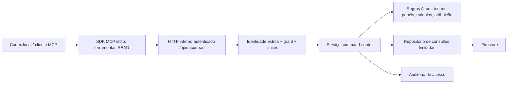

# Altum MCP — arquitetura e contrato de entrega

Data: 2026-09-09. Escopo autorizado: desenho completo, implementação apenas Fase 1.
Base reconciliada: `release/seo-ga4-20260908`, avanço direto de `7f9a1be` para
`b27e698`. Trabalho em `feat/mcp-readonly-command-center`. Nenhum merge de branches
históricas de admin/CRM: os três commits locais exclusivos exigem revisão separada.

## Diagnóstico da base

| Domínio | Evidência reutilizável | Limite observado |
|---|---|---|
| Identidade | `app/lib/server/route-auth.ts`, Firebase Auth, `users` | Verificação existente admite fallback sem revocation check em erro de credencial; entrada MCP exige verificação estrita adicional |
| Multi-tenant | `lib/server/tenant.ts`, `tenant_users`, `client_portal_users` | Compatibilidade legada e privilégio global de agência; MCP acrescenta grant explícito e confere vínculo retornado |
| Permissões comerciais | `lib/server/commercial-access.ts` | Vendedor só acessa registros atribuídos; mesma regra deve alcançar listas, resumos e mensagens |
| Planos | `lib/server/tenant-entitlements.ts`, `lib/tenant-entitlements.ts` | Ausência de contrato usa legado; será identificada na saída, sem inventar plano novo |
| CRM | `crm/pipeline.ts`, `crm/operations.ts`, `stage-transition.ts`, `sales-journey.ts` | Parte da leitura está dentro de Route Handlers; sincronização comercial grava tarefas e eventos |
| Inbox | `chat-operations.ts`, `chat-dispatch.ts`, `messaging/registry.ts` | GET de chats pode sincronizar Messenger; não deve ser usado como leitura MCP pura |
| Implantação | `business-blueprint-provisioning.ts`, API `onboarding/blueprint` | Preview já persiste draft; apply altera funil, automações, KB e settings; rollback completo não existe |
| IA | `ai/agent.ts`, `observability.ts`, `lead-dossier.ts`, `learning-loop.ts` | Há sinais e testes; inferência comercial não constitui prova causal nem avaliação de qualidade completa |
| Catálogo | `commerce/providers/*`, `ecommerce.ts`, `catalog-import-ai.ts` | Integrações podem causar chamadas externas e consumo; fora do MVP de leitura operacional |
| Campanhas | `outbound-campaigns.ts`, `outbound-scheduling.ts`, `automations.ts` | Há executores e jobs; jamais expostos como ferramentas READ |
| Relatórios | `daily-report.ts`, `metrics-summary/route.ts` | Relatório diário também possui persistência/envio; MVP usa indicadores limitados e declara cobertura |
| Integrações | `integrations/health.ts`, `tenant_channels`, `ecommerce_connections` | Health check grava e pode reparar; MVP lê último estado, não realiza novo diagnóstico externo |
| Eventos | `audit_logs`, `leads/{id}/events`, webhooks Meta/WhatsApp/commerce, notificações IA | Não há log global normalizado com cobertura total; MVP oferece feed paginado de auditoria existente |
| Notificações | API `notifications`, push portal, `daily-report`, jobs internos | Reutilizar em fase posterior, não adicionar provedor externo agora |
| Banco | Firestore Admin + Rules, Storage | Admin SDK ignora Rules; isolamento obrigatório no serviço, testes do serviço além de Rules |
| OAuth | Integrações Google/Meta/commerce | São clientes OAuth de terceiros, não servidor de autorização MCP |

## Decisão arquitetural

Ferramentas não importam Firebase e não recebem coleção, query livre, URL de
destino, SQL, userId, role ou tenantId. O endpoint aceita apenas nomes e schemas
fechados. Repositório é a única nova camada que consulta banco; serviços existentes
continuam responsáveis pelas regras. Nenhuma rota pública/admin é reescrita.

O MVP é stdio para Codex local. O bridge encaminha ID token Firebase de usuário
por arquivo local privado, fora do chat. O servidor verifica revogação, usuário
ativo, grant explícito, membership atual, capabilities, módulos e atribuição em
cada chamada. Grants expiram e podem ser revogados na configuração do servidor.
Somente a lista de empresas autorizadas emite contextos assinados, vinculados ao
usuário e à expiração. Contexto não concede acesso por si: revalidação é obrigatória.

`MCP_READ_GRANTS` é uma lista explícita `{userId, tenantId, scopes, expiresAt}`.
`MCP_CONTEXT_SECRET` assina contextos e cursores, sem reutilizar segredo de provider.
`ALTUM_MCP_ENABLED=true` habilita a rota. Tudo desabilitado por padrão.
Limites iniciais: 30 chamadas/minuto/usuário no armazenamento compartilhado,
50 itens/página, 200 documentos/amostra analítica, 30 dias/intervalo, 16 KB/input.
Limites READ não consomem cota de geração IA; não há chamada de modelo no MVP.

ChatGPT web requer endpoint MCP remoto e OAuth próprio (Authorization Code + PKCE,
metadata do recurso/autorização, audience, scopes, refresh rotation/revocation,
consentimento por empresa). Não publicar o bridge de ID token como app remoto.
O login Firebase autentica a pessoa, mas não substitui esse servidor OAuth.

## Contratos comuns

READ usa schemas executáveis em `lib/mcp/contracts.ts` (fonte da verdade do MVP).
Entrada por empresa: `context` opaco, `limit` 1..50, `cursor` quando suportado.
Intervalos explícitos ISO UTC; o resumo diário recebe início/fim do dia local
convertidos pelo cliente. A saída informa timezone da empresa para essa escolha.
Não interpretar “hoje” silenciosamente em UTC.

Saída: `{schemaVersion, requestId, generatedAt, source, data, warnings,
untrustedContent:true}`. Páginas contêm `{items,nextCursor}`; análises contêm
`coverage`, `sampled`, `incomplete`. Valores ausentes são null, não zero inventado.
Links são relativos fixos do painel. Campos são projetados por allowlist, textos
limitados e credenciais comuns redigidas. Conteúdo de conversa/documento é dado
não confiável; nunca define autorização nem solicita execução de ferramenta.

Erros públicos tipados: INVALID_INPUT, UNAUTHENTICATED, FORBIDDEN, EXPIRED_CONTEXT,
INVALID_CURSOR, RATE_LIMITED, UNAVAILABLE. Não devolver stack, token, query ou
mensagem crua do provider. Não converter falha de fonte em lista vazia.

## Matriz completa de evolução

Cada nome na tabela representa uma ferramenta individual. Contratos abaixo são
propostos para fases futuras; só os nomes marcados F1 entram no catálogo executável.
Entradas de WRITE usam `context`; WRITE_HIGH exige `previewId,approvalId,idempotencyKey`.
`page` = limit/cursor; `range` = from/to; `ref` = ID conferido no tenant.

| Ferramenta | Fase | Risco | Entrada além de context | Saída essencial / escopo |
|---|---|---|---|---|
| list_businesses | F1 | READ | nenhuma | empresas e contextos autorizados |
| business_context | F1 | READ | nenhuma | perfil comercial, capabilities, módulos / context:read |
| list_leads | F1 | READ | page, query opcional | contatos/oportunidades atribuídos / crm:read |
| unanswered_leads | F1 | READ | limit | conversas aguardando e leads ligados / crm:read + inbox:read |
| stalled_opportunities | F1 | READ | limit, staleDays | idade da etapa, evidência, hipótese / crm:read |
| list_conversations | F1 | READ | page | conversas e estado da resposta / inbox:read |
| conversation_summary | F1 | READ | conversationId, page | resumo extrativo, mensagens e limites / inbox:read |
| daily_summary | F1 | READ | from,to | amostra operacional e funil / reports:read + crm:read + inbox:read |
| integration_health | F1 | READ | page | último estado conhecido / integrations:read |
| recent_events | F1 | READ | from,to,page | auditoria incremental, cobertura declarada / events:read |
| onboarding_status | F2 | READ | nenhuma | etapas e faltantes / onboarding:read |
| analyze_materials | F2 | DRAFT | assetIds, objetivo | extrações, origem e conflitos / onboarding:draft |
| missing_information | F2 | READ | draftId | perguntas mínimas e justificativas |
| preview_blueprint | F2 | DRAFT | perfil, baseVersion | diff e validações |
| apply_blueprint | F2 | WRITE_HIGH | preview e aprovação | versão aplicada, mudanças, auditoria |
| test_ai_scenarios | F2 | DRAFT | draftId, scenarioIds, budget | respostas, evidências, custo |
| go_live_readiness | F2 | READ | nenhuma | gates reais e limites |
| configuration_history | F2 | READ | page | versões e responsável |
| rollback_configuration | F2 | WRITE_HIGH | version, preview/aprovação | compensação, conflitos e resultado |
| search_contacts_semantic | F3 | READ | query,page | resultados com evidências e confiança |
| create_contact | F3 | WRITE_LOW | contato, idempotencyKey | ref, versão |
| update_contact | F3 | WRITE_LOW | ref,patch,baseVersion | diff aplicado |
| create_opportunity | F3 | WRITE_LOW | contato,etapa,valor | ref, versão |
| update_opportunity | F3 | WRITE_LOW | ref,patch,baseVersion | diff aplicado |
| move_opportunity | F3 | WRITE_HIGH | etapa,preview/aprovação | efeitos de etapa, resultado |
| assign_owner | F3 | WRITE_LOW | ref,ownerRef,baseVersion | responsável e histórico |
| create_task | F3 | WRITE_LOW | ref,prazo,descrição | tarefa e responsável |
| add_note | F3 | WRITE_LOW | ref,texto | nota com autoria |
| update_tags | F3 | WRITE_LOW | ref,tags,baseVersion | tags aplicadas |
| conversation_signals | F3 | READ | ref | intenção/objeção com trechos e incerteza |
| ai_error_candidates | F3 | READ | range,page | suspeitas, não vereditos |
| draft_reply | F3 | DRAFT | ref,objetivo | texto, fontes, alertas |
| compare_periods | F3 | READ | dois ranges | métricas e denominadores |
| conversion_breakdown | F3 | READ | range,dimension | taxas por canal/etapa/vendedor |
| bottlenecks | F3 | READ | range | evidências e hipóteses |
| priority_leads | F3 | READ | page | ranking explicável |
| loss_analysis | F3 | READ | range | motivos registrados e desconhecidos |
| propose_action_plan | F3 | DRAFT | objetivo,range | ações, impacto estimado, risco |
| action_outcomes | F5 | READ | planId | executado, observado, atribuição limitada |
| list_catalog | F3 | READ | page,query | produtos e fonte |
| preview_catalog_update | F3 | DRAFT | mudanças,baseVersion | diff e conflitos |
| update_product | F4 | WRITE_HIGH | preview/aprovação | alterações e histórico; preço sempre HIGH |
| search_knowledge | F3 | READ | query,page | fontes, versão, validade |
| preview_knowledge_update | F3 | DRAFT | assetIds,patch | conflitos, prévia |
| update_knowledge | F3 | WRITE_HIGH | preview/aprovação | versão; muda comportamento da IA |
| knowledge_conflicts | F3 | READ | page | preços/regras contraditórios e desatualizados |
| list_automations | F3 | READ | page | gatilhos e estado |
| explain_automation | F3 | READ | ref | condições, efeitos e limites |
| preview_automation | F3 | DRAFT | definição | validação e efeitos |
| simulate_automation | F3 | DRAFT | draftId,fixtureIds | dry-run sem dispatcher |
| save_automation_draft | F3 | DRAFT | definição | draft versionado |
| pause_automation | F4 | WRITE_HIGH | preview/aprovação | pausa e jobs já em execução |
| activate_automation | F4 | WRITE_HIGH | preview/aprovação | limites e estado |
| draft_campaign | F3 | DRAFT | objetivo,segmento | público estimado e mensagens |
| request_action_approval | F4 | DRAFT | previewId | aprovação fora do controle do modelo |
| send_reply | F4 | WRITE_HIGH | preview/aprovação | recibo de envio |
| launch_campaign | F4 | WRITE_HIGH | preview/aprovação | job com limite rígido |
| create_charge | F4 | WRITE_HIGH | preview/aprovação | cobrança idempotente |
| bulk_update | F4 | WRITE_HIGH | snapshotIds,preview/aprovação | resultado por item |
| execute_plan | F4 | WRITE_HIGH | planVersion,preview/aprovação | execução durável por etapa |
| active_alerts | F5 | READ | page | alertas deduplicados |
| monitor_record | F5 | WRITE_LOW | ref,condição,prazo | regra limitada e revogável |
| create_alert_rule | F5 | WRITE_HIGH | preview/aprovação | destino previamente autorizado |
| schedule_daily_summary | F5 | WRITE_HIGH | horário,destino,aprovação | agenda e limites |
| goal_progress | F5 | READ | goalId,range | progresso com fontes |
| anomaly_candidates | F5 | READ | range | desvio, base e confiança |

WRITE_LOW também pode exigir aprovação pela política do tenant. Mudança de etapa
foi elevada a HIGH porque hoje pode disparar automações. DRAFT não chama executores.

## Auditoria e confirmação

MVP registra requestId, usuário, tenant, ferramenta, hash dos parâmetros (não texto
das conversas), horário, origem, risco READ, resultado/erro e confirmação
`not_required`. Não há alteração operacional: before/after são null. Auditoria de
acesso e rate limit são as únicas escritas novas. Se auditoria falhar, não liberar
dados. Usar coleção privada `mcp_access_audit`, não misturar acessos no feed.

Fases WRITE: before/after selecionados e criptografados quando sensíveis; versão,
hash do preview, aprovação emitida em superfície autenticada independente do
modelo, expiração, destinatários e quantidade vinculados. Claim `confirmed:true`
do modelo não vale. Consumo de aprovação e chave idempotente em transação; retries
retornam resultado anterior. Outbox para efeitos externos. Rollback é compensação
com controle de versão, nunca apagar mensagens já enviadas ou desfazer cobrança
sem operação específica. Retenção inicial proposta: 90 dias, validar política
operacional antes de escala; limpeza/TTL ainda não habilitados no ambiente.

## Eventos e monitoramento

F1: feed **parcial de audit_logs existentes**, com tenant, janela fixa, ordenação
createdAt + ID, cursor assinado por usuário/empresa/filtro, deduplicação por ID.
Não equivale a todas as mensagens, pagamentos ou mudanças de etapa. Sem polling
permanente, sem webhooks externos novos, sem prometer entrega em tempo real.

F5: event log append-only `tenant_events` com eventId, tenantId, aggregateId,
aggregateVersion, type, occurredAt, ingestedAt, actor, source, correlationId e
schemaVersion. Produtor grava evento/outbox na mesma transação da alteração;
dispatcher interno deduplica eventId, usa lease, retry com backoff e dead-letter.
Consumidores de alertas/jobs/notificações existentes mantêm checkpoint e dedupe.
Cursor ordena ingestedAt + ID (não relógio externo); eventos tardios continuam
legíveis. Reprocessamento explícito, lag e cobertura por fonte. Regra de alerta
tem tenant, dono, escopo, expiração e canal autorizado; mensagem não pode alterar
a regra. Não adicionar infraestrutura externa antes de medir volume e latência.

## Fases, aceitação e segurança

F0: este desenho + schemas + evidências. F1: dez ferramentas READ, serviço com
projeções e limite, bridge stdio, demo isolada, testes reais do protocolo e da
autorização. F2: implantação versionada. F3: rascunhos/operação supervisionada.
F4: efeitos externos com aprovação. F5: monitoramento e medição de resultados.

Testes necessários F1: handshake/list/call SDK, token ausente/inválido/revogado,
grant expirado, troca de usuário/contexto/tenant, cursor adulterado/trocado,
membership revogada, módulo/permissão ausentes, vendedor acessando colega,
ID de conversa de outro tenant, limites/paginação, ausência de datas, timestamps
empatados no feed, falha de fonte, redaction, nenhuma ferramenta WRITE,
auditoria indisponível e nenhuma chamada externa de sincronização.
Integração Firebase precisa de ambiente de homologação e usuário de teste real;
fixtures provam regras do serviço, não credenciais/Rules/deploy em produção.

Riscos residuais: conteúdo livre pode conter segredos não reconhecíveis; mínimo
necessário e escopo explícito de conversas. Prompt injection não se resolve só
com regex: sem ferramentas WRITE/segredos na resposta, limites e instruções de
servidor reduzem impacto. Admin SDK exige filtros invariantes. Grants estáticos
e ID tokens curtos são piloto local, não login comercial definitivo. Amostragem
não pode ser vendida como total empresarial. Dados agregados não provam causa.

Fontes consultadas: https://developers.openai.com/codex/mcp,
https://developers.openai.com/api/docs/guides/developer-mode,
https://ts.sdk.modelcontextprotocol.io/server e documentação local Next.js
`node_modules/next/dist/docs/01-app/03-api-reference/03-file-conventions/route.md`.
